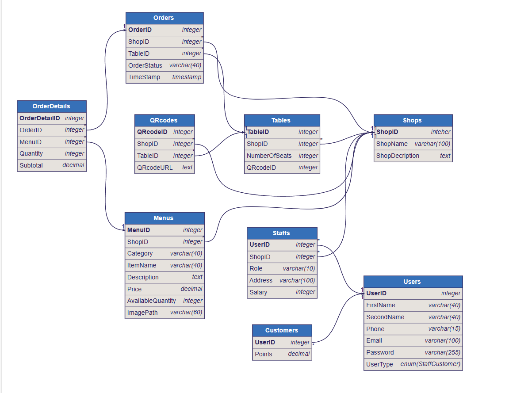

# 📲 MenuScanOrder

**MenuScanOrder** is a **Software as a Service (SaaS)** platform designed to streamline the ordering process for restaurants, cafes, and coffee shops. It enables businesses to easily set up digital menus, generate unique QR codes for each table, and allow guests to place orders seamlessly through their smartphones.

---

## 🧾 Project Description

MenuScanOrder empowers dining establishments to modernize their ordering systems. By creating an account, a restaurant or café can:

- Build a customizable **digital menu** with item categories, descriptions, and prices
- Specify the number of tables in their venue
- Automatically generate unique **QR codes** for each table
- Allow customers to scan QR codes using their smartphones to access the menu and place orders directly
- Enable real-time **order management** for staff to view and fulfill guest orders efficiently

This system reduces manual labor, eliminates the need for physical menus, improves hygiene, and enhances the overall dining experience.

---

## 🚀 Key Features

### 🧾 Digital Menu Creation
Businesses can create and manage their menus digitally, adding categories (e.g., drinks, desserts), item names, prices, and availability with ease.

### 📱 QR Code Generation
Automatically generates a unique QR code for every table in the venue, linking directly to the corresponding digital menu interface.

### 🛒 Seamless Ordering
Guests simply scan the QR code at their table to view the full menu and place their order through their smartphone — no app download required.

### 📦 Real-Time Order Management
Staff can view incoming orders in real time through a dashboard, allowing for efficient kitchen coordination and quicker service.

---

## 💡 Use Cases

- Restaurants looking to digitize their menu and ordering system  
- Cafes and food courts aiming to reduce physical contact points  
- Self-service dining environments  
- Event catering and pop-up restaurants needing dynamic table assignments

---

## 🖼️ 数据库表

